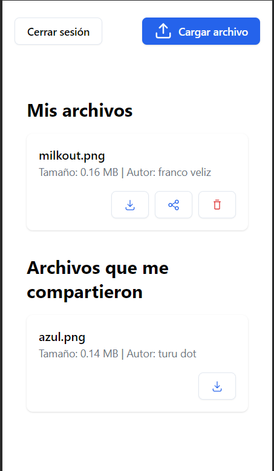
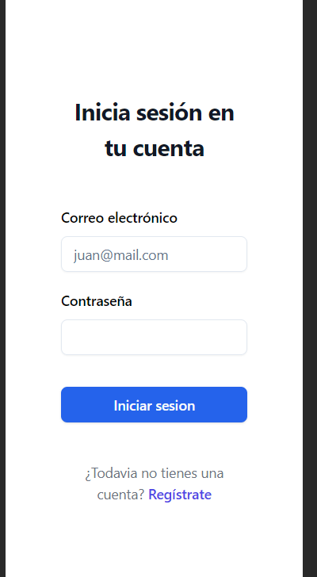

# Prex challenge - Gestión de Usuarios y Archivos

Este desafío consiste en desarrollar una aplicación con Next.js que gestione el registro, inicio de sesión y actividades relacionadas con la carga, visualización y compartición de archivos por parte de los usuarios.

## Demo

[https://prex-challenge.netlify.app/](https://prex-challenge.netlify.app/)




## Features

- Vista mobile.
- La implementación de IndexedDB posibilita la creación y almacenamiento local tanto de la información de los usuarios como de los archivos.
- Registro e Inicio de Sesión:
  - Implementacion de sistema de registro e inicio de sesión con los datos básicos     necesarios.
- Validación de los formularios
- Carga de Archivos
  - Permitir a los usuarios cargar archivos en memoria.
- Compartir Archivos:
  - Permite compartir archivos con otros usuarios.
- Visualización de Archivos:
  - Vista listado de los archivos subidos.
- Eliminación de Archivos
- Descarga de archivos

## Tecnologías utilizadas

- Next.js
- Tailwind
- IndexedDb
- Shadcn
- zod

## Instalación

```bash
  npm install 
  npm run dev
```

Abrir [http://localhost:3000](http://localhost:3000) en el navegador para ver el resultado.

## Explicación de las decisiones tomadas

La primera decisión importante fue el uso de la base de datos de navegador indexedDb, la cual me permitió almacenar la información tanto de los archivos como de los usuarios, además de permitirme la persistencia de la información.

Luego en cuanto estilado, me incline por la librerías tailwind, la cual me parece la más flexible y conveniente en cuanto a optimización y personalización, de igual manera por las mismas razones elegí la librería de componentes shadcn, ya que ambas se complementan perfectamente.

Luego en cuanto al manejo estados globales, utilice el hook useContext, y un custom hook llamado useLocalStorage para el resto de la información.
